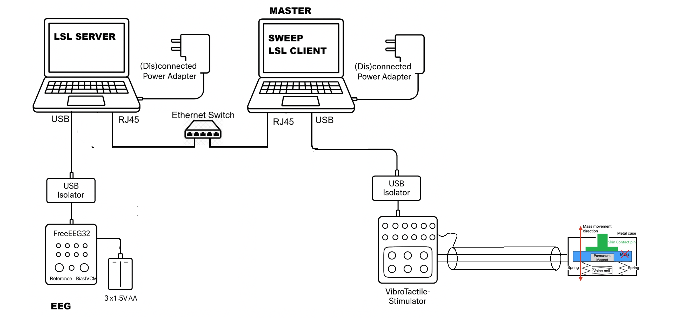

# 🧠 EEGsuite User Manual

Welcome to the **EEGsuite** user manual. This repository is a professional-grade EEG research pipeline designed for high-portability measurements, specifically tailored for Parkinson's Disease studies.

---

## 🏗 System Architecture

The suite consists of three primary layers:
1.  **Hardware & Streaming (`server`)**: Interfaces with EEG hardware (e.g., FreeEEG32) via BrainFlow and broadcasts data to the local network using **Lab Streaming Layer (LSL)**.
2.  **Protocol & Recording (`sweep`)**: Connects to the LSL stream and an external stimulator (VHP device) to run automated experimental protocols.
3.  **Visualization & Analysis (`analyze`)**: Processes recorded CSV/EDF files to generate research-ready plots and metrics.

### 🔌 Hardware Connection Schematic


*Note: Ensure USB Isolators are used as shown to maintain signal integrity.*

For specific electrode placement used in the KULLAB measurements, see the [KULLAB 32 Montage Documentation](MONTAGE_KULLAB.md).
For the 8-channel motor cortex montage, see the [FREG8 Montage Documentation](MONTAGE_FREG8.md).

The hardware setup is designed for maximum signal purity and participant safety:

*   **Acquisition Node (Left)**: The FreeEEG32 is battery-powered (3x1.5V AA) and connected via a USB Isolator. The acquisition laptop should ideally run on DC power (battery) to eliminate 50/60Hz mains interference.
*   **Control Node (Center)**: The Master laptop manages the protocol and stimulation. It communicates with the acquisition node via a local Ethernet switch for low-latency LSL streaming.
*   **Visualization Node**: (Optional) A dedicated PC for real-time monitoring of EEG streams without adding load to the Control Node.
*   **Vibrotactile Stimulator (Right)**: A voice-coil based actuator delivering precise tactile stimuli. It is electrically isolated from the EEG acquisition branch to prevent electromagnetic leakage.

---

## 🧪 Experiment Procedure & Quick Start

For detailed instructions on preparing the hardware, starting the LSL stream, and running experimental protocols, please refer to the **[Quick Start Guide](protocol/QUICK_START.md)**.

---

## 📁 Project Structure

*   `/config`: YAML files for hardware and experimental protocols.
*   `/data`: All recordings (CSV/EDF) are stored here.
*   `/logs`: Detailed session logs for debugging.
*   `/reports`: Analysis results and visualizations.
*   `/src`: The core source code.
    *   `streaming/`: BrainFlow/LSL implementation.
    *   `recording/`: Sweep protocol implementation.
    *   `analysis/`: Data processing tools.
    *   `vbs/`: Hardware-specific resources.
        *   `firmware/`: VHP device source code (Main & Experimental).
            *   See [Firmware Technical Docs](../vbs/firmware/README.md#technical-documentation) for hardware-level sensing and timing guides.
        *   `webui/`: Bluetooth control interface.

---

## 🔬 Performance & Timing Precision

This suite is optimized for high-precision academic research. Based on empirical validation:

*   **Timing Accuracy**: See findings in the [Performance Section](#performance--timing-precision).
*   **EM Integrity**: For detailed measurements on stimulator cross-talk and filter effectiveness, see the [Hardware Validation Report](HARDWARE_VALIDATION_EMI.md).

### 1. Synchronization Accuracy
*   **Mean Latency**: $\approx 6.0\text{ms}$ (Command to physical vibration).
*   **Marker Precision**: Event markers are synchronized with EEG data at a resolution of **1.95ms** (at 512 Hz sampling).
*   **Jitter**: $\pm 5\text{ms}$, primarily driven by Windows OS thread scheduling.

### 2. Implementation Details
*   **Non-Blocking Commands**: Critical `Start` (1) and `Stop` (0) serial commands are sent with zero software delay to ensure immediate hardware response.
*   **Deterministic Markers**: Markers are attached to the actual LSL sample timestamps, ensuring that even if there is a small transmission delay, the "Stimulation ON" label in your CSV matches the exact sample where the signal appears.

---

### 💾 Changing Data Storage Location
By default, the system saves data to the `/data` folder in the project root. If your cloud drive is unreachable or you wish to use a different location:

#### Option 1: CLI Override (Recommended for quick changes)
Use the `--data-root` argument before the command:
```bash
python -m src.main --data-root "path/to/data" sweep -d config/hardware/freeeeg.yaml -p config/protocols/sweep_default.yaml
```

#### Option 2: Environment Variable (Persistent)
Set the `EEG_CLOUD_ROOT` environment variable. The system will create `data/`, `logs/`, and `reports/` inside this path.
*   **Windows (PowerShell)**: `[System.Environment]::SetEnvironmentVariable('EEG_CLOUD_ROOT', 'D:/EEG_Storage', 'User')`
*   **Linux/Mac**: `export EEG_CLOUD_ROOT="/path/to/storage"`

#### Option 3: Google Drive Integration (Automated API)
For researchers using Google Drive, a dedicated utility is available in `src/utils/google_drive.py`. This uses the Google Drive API for authenticated downloads.

1.  **Setup**: Place your `credentials.json` from Google Cloud Console in the `config/` directory.
2.  **Configure**: Update `config/google_drive.yaml` with your target `folder_id`.
3.  **Run**: 
    ```powershell
    python src/utils/google_drive.py
    ```
4.  **Authentication**: The first run will open a browser for OAuth2 authentication. Subsequent runs will use the stored `config/token.json` until it expires.

For administrators managing permissions and test users, see the **[Google Drive Admin Guide](ADMIN_GOOGLE_DRIVE.md)**.

---

## 🧪 Development Rules
This project follows strict academic standards:
*   **Determinism**: `RANDOM_SEED: int = 42` is defined in all relevant files.
*   **Paths**: Always use `pathlib.Path`, never strings.
*   **Logging**: No `print()` statements; use `logging.getLogger(__name__)`.
*   **Docstrings**: Follow the Google Python Style Guide.

---

## ❓ Troubleshooting

**"Could not bind multicast responder"**
*   This is a BrainFlow warning. It is usually harmless and does not prevent data streaming.

**"LSL stream not found"**
*   Ensure the `server` command is running in a separate terminal before starting a `sweep`.

**"Serial port permission denied"**
*   Check that no other software (like Arduino IDE or a previous session) is holding the COM port open.
